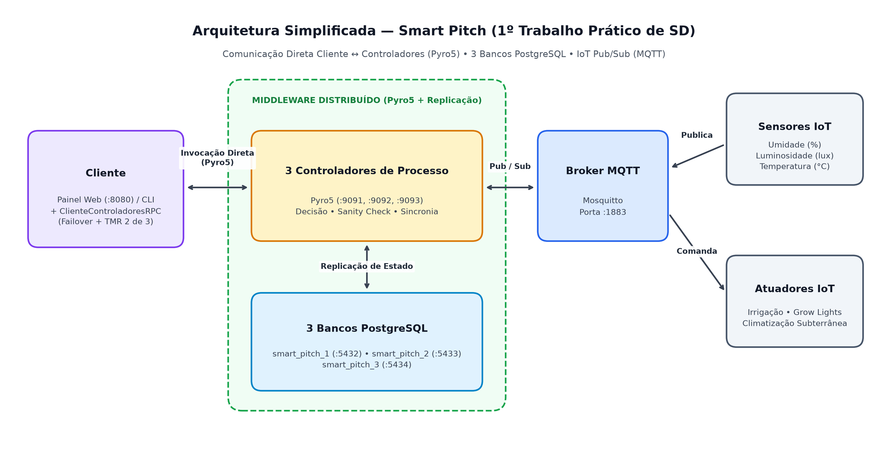
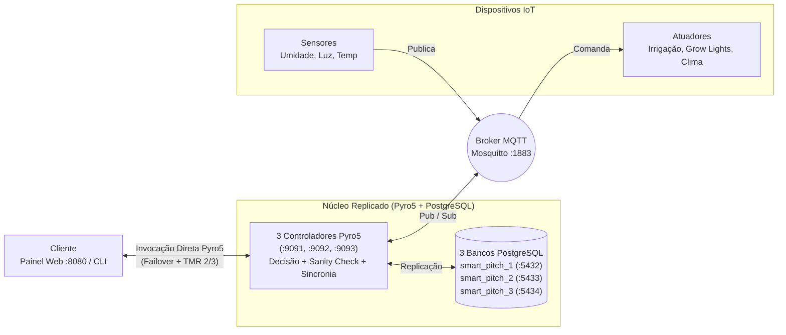

# Diagrama Simplificado da Arquitetura — Smart Pitch

```mermaid
flowchart LR
    CLI["Cliente<br/>Painel Web :8080 / CLI"]

    subgraph CORE["Núcleo Replicado (Pyro5 + PostgreSQL)"]
        direction TB
        CTRL["3 Controladores Pyro5<br/>(:9091, :9092, :9093)<br/>Decisão + Sanity Check + Sincronia"]
        DB[("3 Bancos PostgreSQL<br/>smart_pitch_1 (:5432)<br/>smart_pitch_2 (:5433)<br/>smart_pitch_3 (:5434)")]
        CTRL <-->|"Replicação"| DB
    end

    MQTT(("Broker MQTT<br/>Mosquitto :1883"))

    subgraph IOT["Dispositivos IoT"]
        direction TB
        SEN["Sensores<br/>Umidade, Luz, Temp"]
        ATU["Atuadores<br/>Irrigação, Grow Lights, Clima"]
    end

    CLI <-->|"Invocação Direta Pyro5<br/>(Failover + TMR 2/3)"| CTRL
    CTRL <-->|"Pub / Sub"| MQTT
    SEN -->|"Publica"| MQTT
    MQTT -->|"Comanda"| ATU
```
